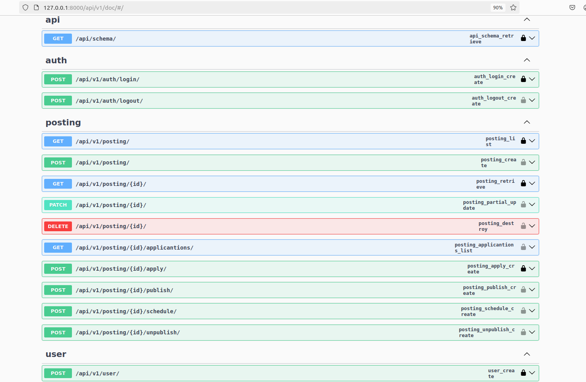
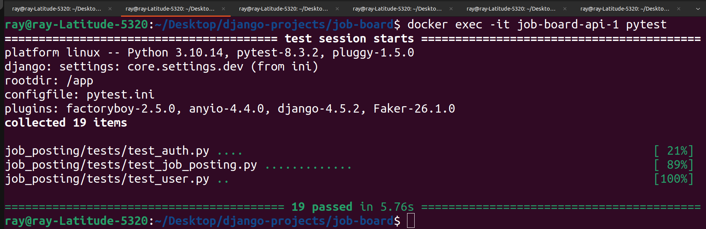
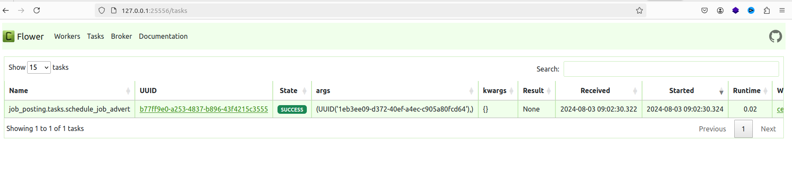

# Job Posting
API backend of a simple job posting application.
  
# Tools & Services:
- Django & DRF : for building the APIs
- Pytest: Testing Framework
- Docker & Docker compose: Containerization
- Celery: Task scheduling
- Flower: Task monitoring
- RabbitMQ: Celery broker
- PosgreSQL: Relational DB
- Code Formatter: Black

# Running locally

Create a .env file by copying the .env.sample provided and run:

```
docker compose -f docker-compose.yml up --build
```
to build and run the container using the yaml file.

Access docs:
```sh
http://localhost:8000/api/v1/doc
```

# Running In a VirtualEnv

Create a virtual environment using:
```
python3 -m venv venv
```

```
pip install -r app/requirements/dev.txt
```
Externalize the database

Navigate to app directory and run migrations using:

```
python manage.py makemigrations

python manage.py migrate
```

Run the server using:
```
python manage.py runserver
```

# Run tests
Run descriptive tests in the container using:
```
docker compose exec <docker_container_name> pytest
```

or Run test in the app dir for an activated virtualenv using:

```
pytest -v -rA
```

# API Doc


# Test Output


# Create User from the shell
```
docker exec -it job-board-api-1 python manage.py shell
from job_posting.models import User
User.objects.create_user(email="1@gmail.com", password="12345")
```

# Flower dashboard



# Improvements
- Add a more secure token authentication scheme
